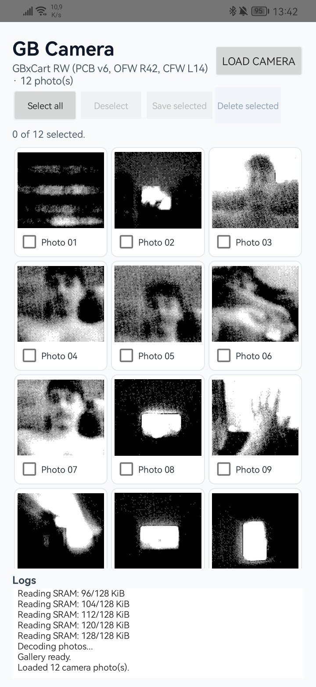

#   GBxCAM Viewer
An Android app to view and transfer photos from the Game Boy Camera to your Android device.

## Prequisites

- Anroid phone
- GB Camera
- GBxCart RW 1.4 or later

## Screenshots

## License

This project is licensed under the [GNU General Public License v3.0 or later](LICENSE).

### Acknowledgments

- USB protocol implementation based on [FlashGBX](https://github.com/lesserkuma/FlashGBX) (GPL-3.0)
- Game Boy Camera technical documentation by Antonio Niño Díaz ([CC BY 4.0](https://creativecommons.org/licenses/by/4.0/)), from [gbcam-rev-engineer](https://github.com/AntonioND/gbcam-rev-engineer)

