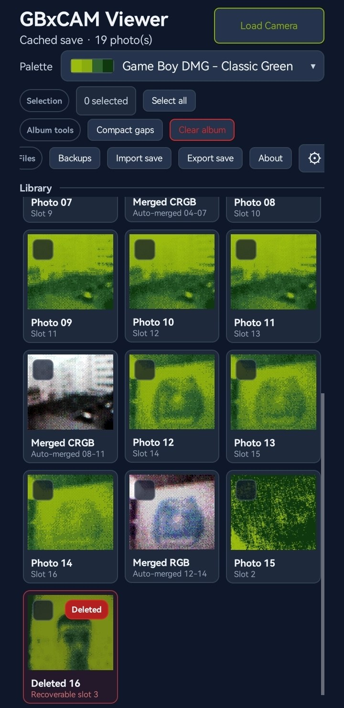

#  GBxCAM Viewer

An Android app to view and transfer photos from the Game Boy Camera to your Android device.  
Download the apk on the [releases page](https://github.com/tolik518/GBxCAM-Viewer/releases).

## Prerequisites

- Android phone
- GB Camera
- [GBxCart RW 1.4 or later](https://www.gbxcart.com/)

## Screenshots

## License

This project is licensed under the [GNU General Public License v3.0 or later](LICENSE).

### Acknowledgments

- USB protocol implementation based on [FlashGBX](https://github.com/lesserkuma/FlashGBX) by [@lesserkuma](https://github.com/lesserkuma) (GPL-3.0)
- Game Boy Camera technical documentation by [Antonio Niño Díaz](https://github.com/AntonioND) ([CC BY 4.0](https://creativecommons.org/licenses/by/4.0/)), from [gbcam-rev-engineer](https://github.com/AntonioND/gbcam-rev-engineer)
- Save file injection research by [Raphaël Boichot](https://github.com/Raphael-Boichot) ([Inject-pictures-in-your-Game-Boy-Camera-saves](https://github.com/Raphael-Boichot/Inject-pictures-in-your-Game-Boy-Camera-saves))
- The codebase was created with heavy AI assistance, using Codex with GPT 5.5
